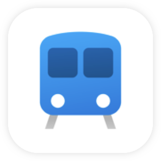

# Better Rail

 &nbsp; 

Better Rail is an open source mobile client for Israel Railways, with an emphasis on great design, performance and accessbility.

[**Available on iOS**](https://apps.apple.com/app/better-rail/id1562982976)</a> (Android coming soon)

## Overview

Better Rail is written with React Native and uses the [Ignite boilerplate](https://github.com/infinitered/ignite/).  
If you haven't used Ignite before, it's recommended to take a look over their README and see their approach for writing React Native apps.

### Installation

The following steps asssumes your enviorment is already set up for running React Native apps.  
If this is your first time, check out the [official set up guide](https://reactnative.dev/docs/0.63/environment-setup) beforehand.

- Fork the repo and clone to your machine.
- Run `yarn install`
- Run `cd ios && pod install`
- Run the app with `npm run ios`

### License

The source code is released under the [AGPL-3.0 license](https://github.com/act-1/native/blob/main/LICENSE).  
The project assets - the user interface, app branding, images, illustations, icons and fonts are outside the scope of the license.
